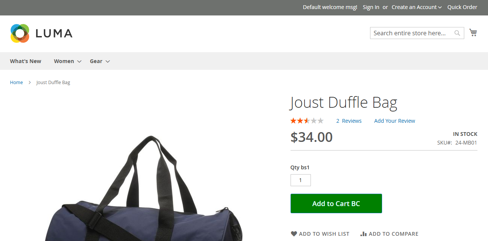
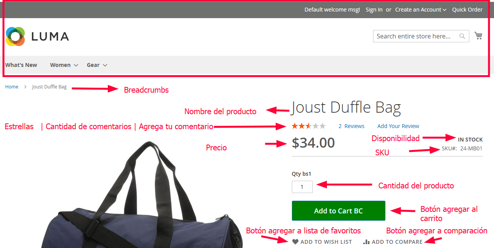

# Detalle del producto

Esta página servirá como índice

Las reglas de negocio se enlistarán en otros archivos

Revisaremos parte por parte de la página "Detalle del producto"

## Parte 1

Primero se verá el diseño SIN notas, después se muestra una imagen con notas para detallar cada punto del PDP

### Sin notas

### Con notas

***Recuerda que el orden de explicar cada punto es de arriba a abajo, de izquierda a derecha***

[...]

### Precio

Es el precio del producto

### Disponibilidad

Se mostrará "IN STOCK" cuando tengamos inventario del producto
Se mostrará "OUT OF STOCK" cuando ya NO tengamos inventario del producto

### Cantidad del producto

Es un elemento tipo "input text" donde el cliente podrá escribir la cantidad de productos que desea comprar

### Botón agregar al carrito

[Ver archivo "Reglas de negocio para el boton agregar al carrito" en Documentacion/02_FlujoVentas/11_DetalleProducto/reglas_negocio/10_boton_agregar_al_carrito.md](10_boton_agregar_al_carrito.md)

### Botón agregar a la lista de favoritos

Agregará este producto a la lista de favoritos

### Botón agregar a comparación

Agregará este producto a la página del comparador de productos

